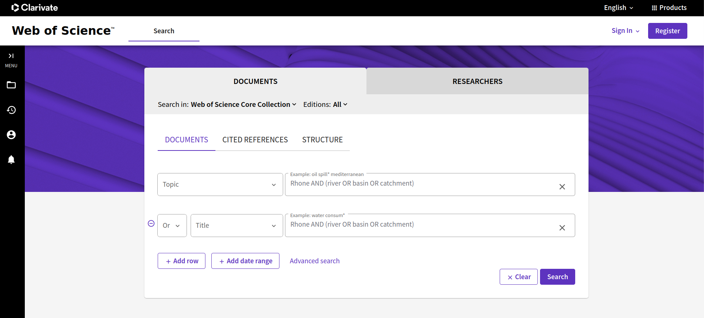
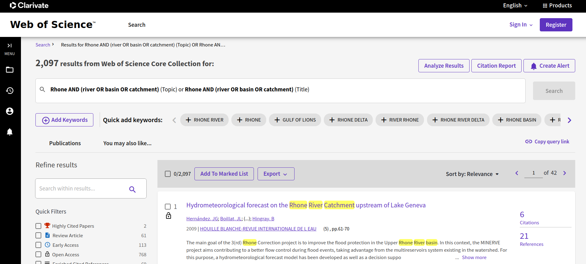

```{r, include = FALSE}
knitr::opts_chunk$set(
  collapse = TRUE,
  comment = "#>"
)
```

```{r setup}
library(bibou)
```


# Get bibliographic data from Web of Science

Let's imagine we wanted to obtain bibliographic data from Web of Science about the Rhone river. We searched keywords "Rhone" and "river" (or "basin" or "catchment") either in title or topic field.

{width="600px"}

Here we obtained a bit more than 2000 references, which is too much for a single export. Indeed, in case one wants to export the full references, including cited references, the maximum number of references one can export at once is 500. We're going to export bibliographic references in several batches, according to years of publication.

{width="600px"}

Here, we're going to repeat this process for periods going to

- 1957 to 1999,
- 2000 to 2007,
- 2008 to 2014,
- 2015 to 2020,
- 2021 to 2024


