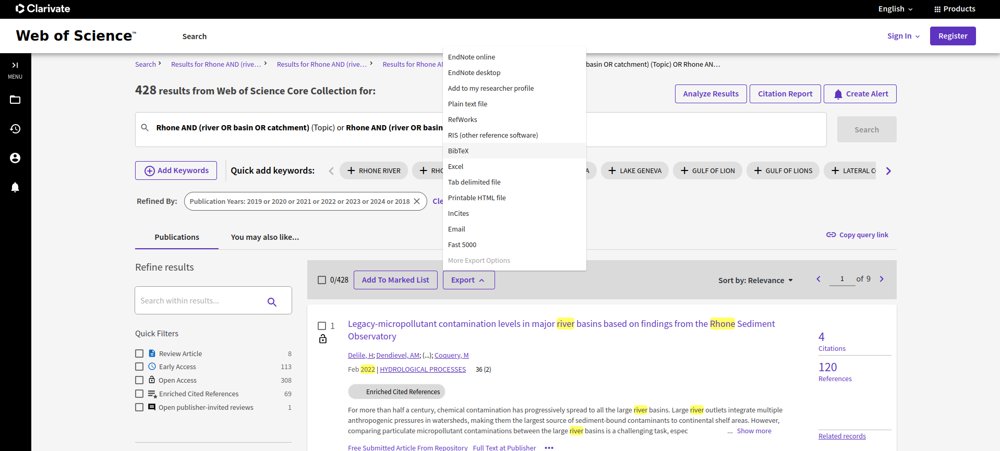
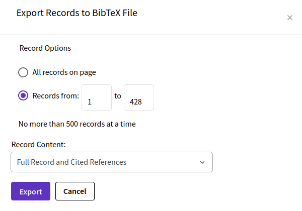

```{r, include = FALSE}
knitr::opts_chunk$set(
  collapse = TRUE,
  comment = "#>"
)
```

```{r setup}
library(bibou)
library(tidyverse)
```


# Get bibliographic data from Web of Science

Let's imagine we wanted to obtain bibliographic data from Web of Science about the Rhone river. We searched keywords "Rhone" and "river" (or "basin" or "catchment") either in title or topic field.  

<br>

{width="600px"}

<br>
   
Here we obtained a bit more than 2000 references, which is too much for a single export. Indeed, in case one wants to export the **full references, including cited references**, the maximum number of references one can export at once is 500. We're going to export bibliographic references in **several batches**, according to years of publication.

<br>

{width="600px"}

<br>

Here, we're going to repeat this process for periods going to

- 1957 to 1999,
- 2000 to 2007,
- 2008 to 2014,
- 2015 to 2020,
- 2021 to 2024

<br>

{width="600px"}

<br>

{width="300px"}

<br>

We hence obtain 5 .bib export files, which are provided with the package (you can find their path once the bibou package is installed with function `system.file()`).

We **merge** these files into a single file using bibou's function `bib_merge_files()`:

```{r merge}
bibtex_file_1=system.file("savedrecs(1).bib",package="bibou")
bibtex_files=purrr::map_chr(as.character(1:5),~stringr::str_replace(bibtex_file_1,"1(?=\\).bib)",.x))
bibtex_files
bib_merge_files(bibtex_files,
                to="data/savedrecs_merged.bib")
```

When exporting from Web of Science in several batches, one can mistakenly export the same references several times. The function `bib_remove_duplicates()` can clean the merged files by **removing duplicated references** (detected based on their common identifier).

```{r remove_duplicates}
bib_remove_duplicates(from_file="data/savedrecs_merged.bib",
                      to_file="data/savedrecs_clean.bib")
```


We can now import these references as a table using function `bib_tib_doc()`. This import relies on the `bibliometrix` package import method and, as such, formats descriptors in the same way. The **complete list of descriptors** is available [here](https://www.bibliometrix.org/documents/Field_Tags_bibliometrix.pdf). 

The most important fields are:

|Variable|Description|
|:---------|:----------|
|AU|	Authors’ Names |
|TI| 	Document Title |
|SO| 	Journal Name (or Source) |
|JI| 	ISO Source Abbreviation |
|DT| 	Document Type |
|DE| 	Authors’ Keywords |
|ID| 	Keywords associated by WoS database |
|AB| 	Abstract |
|C1| 	Authors’ Affiliations |
|CR| 	Cited References |
|TC| 	Times Cited |
|PY| 	Publication Year |
|SC| 	Subject Category |
|UT| 	Unique Article Identifier |


```{r tib_doc, warning=FALSE, message=FALSE}
library(bibliometrix)
tib_doc=bib_tib_doc("data/savedrecs_clean.bib")
dim(tib_doc)
colnames(tib_doc)
```

```{r show_tib_doc}
tib_doc %>% 
  select(AU,TI,SO,DT,DE,TC,PY) %>% 
  head(10) %>% 
  knitr::kable()
```


